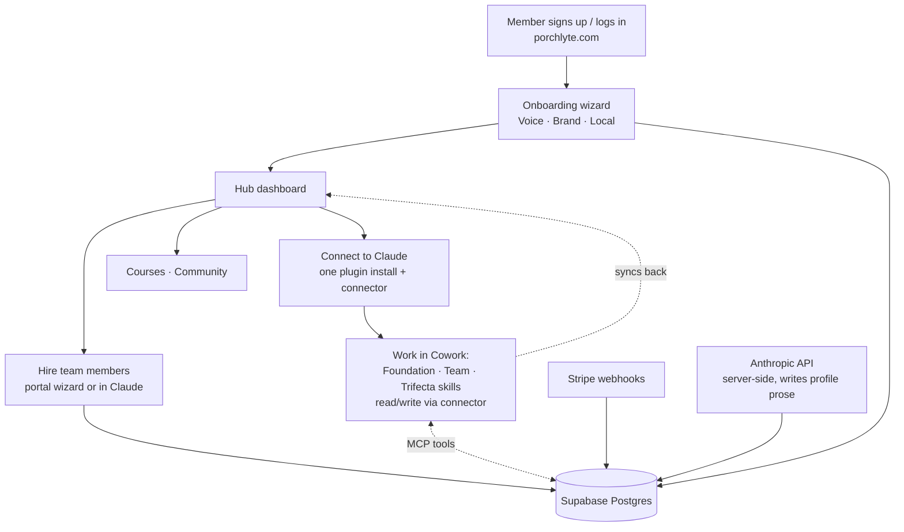

# PorchLyte Agent Platform — Implementation Plan

**Status:** Working plan · started July 21, 2026
**Repo:** `PorchLyte/porchlyte-agent-platform` (Next.js 16 + Supabase + Vercel)
**Supersedes for build purposes:** the higher-level `../mcp-server-implementation-plan.md` (architecture rationale) and `../build-outline.md` (task list). This doc is the hands-on build reference.

This is the doc we build against. It carries the phase plan, the schema, the tool surface, and — critically — the **paths to every source-of-truth file** in the existing plugins, so we can port interview questions, profile formats, and skill behavior into the platform without guessing.

---

## Source-of-truth files (reference while building)

The platform re-implements setup logic that currently lives in three Cowork plugins. When building the onboarding wizard, the profile-writing prompts, or the consolidated plugin, **read the original skill file first** — it holds the exact interview questions, the profile prose format, and the behavior rules. Do not paraphrase from memory; port from these.

All paths are relative to the workspace root (`/Users/tie/dev/porchlyte/`).

### Foundation plugin — `porchlyte-foundations/`
The three personalization skills every other skill reads from.

| Concern | Path |
|---|---|
| Marketplace manifest | `porchlyte-foundations/.claude-plugin/marketplace.json` |
| Plugin manifest (version) | `porchlyte-foundations/plugins/ai-agent-foundation/.claude-plugin/plugin.json` |
| Voice skill (interview Q1–Q11, profile format) | `porchlyte-foundations/plugins/ai-agent-foundation/skills/voice/SKILL.md` |
| Brand skill (interview Q1–Q10) | `porchlyte-foundations/plugins/ai-agent-foundation/skills/brand/SKILL.md` |
| Local skill (interview Q1–Q10, fair-housing rules) | `porchlyte-foundations/plugins/ai-agent-foundation/skills/local/SKILL.md` |
| `/foundations-setup` command (wizard flow, resume logic) | `porchlyte-foundations/plugins/ai-agent-foundation/commands/foundations-setup.md` |
| `/rescue` command (migration recovery, signature phrases) | `porchlyte-foundations/plugins/ai-agent-foundation/commands/rescue.md` |

### Team plugin — `porchlyte-agents/`
The nine hires. Each SKILL.md holds that agent's interview questions, profile format ("Darla is…"), behavior rules, connector usage, and hard rules.

| Agent | Role | Path |
|---|---|---|
| Darla | Daily briefing (scheduled) | `porchlyte-agents/plugins/ai-agent-team/skills/darla/SKILL.md` |
| Chloe | Content strategist | `porchlyte-agents/plugins/ai-agent-team/skills/chloe/SKILL.md` |
| Ella | Email expert | `porchlyte-agents/plugins/ai-agent-team/skills/ella/SKILL.md` |
| Poppy | Podcast producer | `porchlyte-agents/plugins/ai-agent-team/skills/poppy/SKILL.md` |
| Treena | Transaction coordinator | `porchlyte-agents/plugins/ai-agent-team/skills/treena/SKILL.md` |
| Lia | Listing amplifier | `porchlyte-agents/plugins/ai-agent-team/skills/lia/SKILL.md` |
| Sloane | Sphere manager (roster) | `porchlyte-agents/plugins/ai-agent-team/skills/sloane/SKILL.md` |
| Rhonda | Relocation expert (scheduled scan) | `porchlyte-agents/plugins/ai-agent-team/skills/rhonda/SKILL.md` |
| Olivia | Objection vault | `porchlyte-agents/plugins/ai-agent-team/skills/olivia/SKILL.md` |
| `/set-me-up` command (hiring flow) | — | `porchlyte-agents/plugins/ai-agent-team/commands/set-me-up.md` |
| Plugin manifest | — | `porchlyte-agents/plugins/ai-agent-team/.claude-plugin/plugin.json` |

### Trifecta plugin — `real-estate-trifecta/`
Three high-stakes-moment skills. Read from Foundation, hand off to Team. **These build on top of Foundation + Team but do not have their own hire/setup interviews** — they're workflow skills, not personas. The platform should surface them as available tools/workflows, not as "hires" with profiles.

| Skill | Moment | Path |
|---|---|---|
| Buyer Consultation | Win the buyer meeting; build Home Buyer Guide | `real-estate-trifecta/plugins/real-estate-trifecta/skills/buyer-consultation/SKILL.md` |
| Listing Presentation | Win the listing; pricing story + deck | `real-estate-trifecta/plugins/real-estate-trifecta/skills/listing-presentation/SKILL.md` |
| Closing Day | Accepted offer → keys (US + Canada) | `real-estate-trifecta/plugins/real-estate-trifecta/skills/closing-day/SKILL.md` |
| Plugin manifest | — | `real-estate-trifecta/plugins/real-estate-trifecta/.claude-plugin/plugin.json` |

### Planning docs (context)
- `docs/mcp-server-implementation-plan.md` — architecture rationale, why portal-first, why one plugin
- `docs/build-outline.md` — technical task list
- `docs/build-outline-client.md` — the $5k client offer (plain language)
- `docs/connectors-directory-submission.md` — optional directory listing (phase 6+)

> **Product surface is THREE plugins, not two.** Earlier planning docs said "Foundation + Team." The Trifecta is a real third product. The consolidated plugin and the platform must account for all three. Foundation and Team have setup interviews; Trifecta skills are workflows that read existing Foundation/Team data.

---

## The platform, in one picture



Two doors into one database: the **portal** (web, no Claude needed) and the **MCP connector** (Claude, during real work). Stripe drives access. The Anthropic API turns wizard answers into profile prose server-side.

---

## Data model

Supabase Postgres. Migrations live in `supabase/migrations/`. RLS on every member-facing table.

```
members
  id (uuid, pk)              -- app user id (Supabase auth.users.id)
  email (unique)
  name
  status                     -- active | paused | canceled  (from Stripe)
  plan                       -- foundations | team | trifecta | full  (what they can access)
  stripe_customer_id
  created_at

profiles                     -- the three Foundations
  id (uuid, pk)
  member_id (fk)
  kind                       -- voice | brand | local
  content                    -- text, plain-prose profile (format from the SKILL.md files)
  status                     -- complete | partial | empty
  interview_answers          -- jsonb, raw Q&A (regenerate prose later without re-interviewing)
  updated_at
  updated_by                 -- portal_wizard | mcp_claude | admin
  unique (member_id, kind)

team_profiles                -- the nine hires
  id (uuid, pk)
  member_id (fk)
  agent                      -- darla|chloe|ella|poppy|treena|lia|sloane|rhonda|olivia
  content                    -- text
  status                     -- not_hired | partial | hired
  interview_answers          -- jsonb
  updated_at
  updated_by
  unique (member_id, agent)

usage_events                 -- powers member + admin analytics
  id (uuid, pk)
  member_id (fk)
  agent                      -- nullable (foundation/trifecta events have none)
  event                      -- session_start | profile_read | profile_saved | task_run | trifecta_used
  metadata                   -- jsonb
  created_at

scheduled_tasks              -- hub-managed state for Darla's brief, Rhonda's scan
  id (uuid, pk)
  member_id (fk)
  agent                      -- darla | rhonda
  state                      -- active | paused
  schedule_label             -- human-readable ("weekdays 7:00 AM")
  last_run_at
  last_run_summary
  updated_at
  unique (member_id, agent)

connector_status             -- diagnostic dashboard
  member_id (fk, unique)
  plugin_installed_version
  plugin_latest_version
  last_successful_sync_at
  connector_linked_at

audit_log
  id, member_id, actor, action, entity, created_at
```

Notes:
- **Trifecta needs no table of its own for now.** Its skills read Foundation (and Team, when active) and produce documents; there's no per-member "trifecta profile" to store. Track usage via `usage_events` (`event: trifecta_used`). Revisit if members want saved Home Buyer Guides / listing decks persisted — that would be a `documents` table, phase 5.
- **Client records, Objection Vault, Sloane's roster stay in Google Drive** (unchanged from the plugins). Not migrated into Postgres in early phases.
- `plan` values expanded to cover the three-plugin reality: `foundations` (Foundation only), `team`, `trifecta`, `full`. Server-side gating checks this.

---

## MCP tool surface

Served from this app's route handlers (`src/app/api/mcp/...` on Vercel). OAuth 2.1 + PKCE. Read and write always separate tools (directory requirement + good design).

| Tool | Kind | Notes |
|---|---|---|
| `get_foundations` | read | All three foundations in one call; skills call at session start |
| `save_foundation` | write | Upsert one foundation, sets status |
| `get_team_member` | read | Returns `not_hired` so the skill can offer to hire in chat |
| `save_team_member` | write | Same call whether portal- or chat-initiated |
| `get_setup_status` | read | Full summary; powers plugin resume + portal dashboard |
| `save_partial` | write | Mid-interview resume, chat or portal |
| `get_task_state` | read | Scheduled skills check at run start; if paused, exit quietly |
| `log_task_run` | write | Scheduled skills log each run → hub panel |

- **Usage logging is automatic**, server-side, on every tool call → `usage_events`. No dedicated tool.
- **Plan gating in the tool layer:** `save_team_member` checks `members.plan` before writing; Trifecta skills' reads check plan too.
- Phase 5 adds `add_memory`, `search_memories`, `log_touch`.

---

## Phases

### Phase 0 — Foundation setup ✅ (done July 21)
- Next.js 16 app scaffolded, Supabase clients (browser/server/admin), proxy session refresh, env template, repo in PorchLyte org.

### Phase 1 — Data layer (in progress, July 21)
- [ ] **Bundled-connector spike** — stub plugin with the MCP connector declared in its manifest, installed from a `.zip` on a clean account, confirm OAuth fires in Cowork. Decide "one install" vs "install + separate connector add" from evidence. *(Needs a clean Claude account — running in parallel with the build.)*
- [x] Schema migration (all tables above) in `supabase/migrations/`, with RLS policies. Applied to the live project July 21; `handle_new_user` trigger auto-creates the member row on signup (verified). Typed clients via `src/lib/supabase/types.ts` — regenerate after every migration.
- [x] MCP server route handlers + OAuth 2.1 + the eight tools. Lives at `src/app/api/mcp/[transport]/route.ts` (Streamable HTTP at `/api/mcp/mcp`, SSE disabled — no Redis needed). **OAuth decision: Supabase Auth is the OAuth 2.1 authorization server** (its beta OAuth Server feature) — we host only the consent page (`/oauth/consent` + `/api/oauth/decision`) and the RFC 9728 protected-resource metadata route; Supabase handles authorize/token/PKCE/dynamic client registration. Requires dashboard setup: Authentication → OAuth Server → enable, authorization path `/oauth/consent`, enable dynamic client registration; Site URL must be set in URL Configuration.
- [x] REST API routes for the portal (same DB, no Claude) under `src/app/api/portal/`. Both doors call the same functions in `src/lib/porchlyte/operations.ts` — plan gating, status gating, and automatic usage logging live there once.
- [x] Test: both doors read/write the same records. **Passed July 21** via `scripts/mcp-door-test.sh`: initialize + all 8 tools listed; `save_foundation` → `get_foundations` round-trip with `updated_by: mcp_claude`; plan gate correctly refused `save_team_member` on a `foundations` plan with the member-friendly message; unauthenticated requests 401 on both doors; `usage_events` and `connector_status` written automatically server-side. Test member: `tie+porchlyte-mcp-test@madebytie.com`. Admin client uses the new-format `SUPABASE_SECRET_KEY` (legacy `SUPABASE_SERVICE_ROLE_KEY` still works as fallback).

### Phase 2 — Portal onboarding + dashboard (in progress, July 21)
Built and verified rendering live against the seeded test member (hub, foundation wizard, agent dashboards all return 200 with real data). Theme ported verbatim from the plugin onboarding HTML (`porchlyte-foundations/docs/*.html`): warm tan/cream/ink palette, Impact display + Poppins body, in `src/app/globals.css` + `src/app/hub/hub.css`. Sidebar shell with expandable Foundations (3) + Agents (9), status dots. Agent/foundation content ported from the SKILL.md files into `src/lib/porchlyte/content.ts` (single source for sidebar, dashboards, and wizard questions). Standalone email/password login at `/login` as the fallback for the Claude OAuth-consent flow and direct visits (GHL SSO is the primary path, still to build).
- [x] Voice/Brand/Local wizard — questions ported verbatim; save-and-resume via `save_partial`; **finish step generates prose server-side** via `src/lib/porchlyte/generate-profile.ts` (Anthropic `claude-opus-4-8`, using the exact signature openers + rules from each foundation SKILL.md: "You write like…", "Your brand is…", "Your market is…", plain prose, no bullets/headers, no invention). Endpoint: `src/app/api/portal/foundations/generate`. *(Live prose generation blocked only on the real `ANTHROPIC_API_KEY` in `.env.local` — still the `sk-ant-...` placeholder.)*
- [x] Per-agent hub pages: purpose, what-they-do, useful ways to use, tips, one-click-copy prompts (seeded; Tracy fills more), status, and the Darla/Rhonda schedule panel (pause/resume toggle wired to `PATCH /api/portal/tasks/[agent]`).
- [x] Hub dashboard with foundation chips, agent status grid, and connector diagnostics (installed-vs-latest version line, last-sync, connect-to-Claude CTA).
- [ ] Admin views (setup status, usage analytics, edit-with-consent) — not started.
- [ ] Account page (membership status, disconnect Claude, export data) — sidebar link exists, page not built.
- [ ] Auth (Supabase Auth) wired to porchlyte.com login. **GHL embed decision (July 21):** the portal will be embedded in the GHL membership/course area, with the member's existing GHL session driving sign-in. Supabase Auth stays the identity backbone (members.id = auth user id; the MCP OAuth flow depends on it) — GHL becomes an identity *source*: a server-verified SSO handoff (GHL marketplace-app SSO key decrypts the postMessage payload) that finds-or-creates the Supabase user by email and mints their session. Needs: (a) spike to confirm GHL's SSO postMessage actually fires inside a membership-area embed, not just marketplace custom pages; (b) Safari/iframe third-party-storage test early — fallback is "open portal in new tab" from the course area; (c) a standalone magic-link login for contexts outside GHL (the OAuth consent page when connecting from Claude, direct visits); (d) later migration adds `ghl_contact_id` to `members` as the stable join key rather than relying on email forever.
- [ ] Voice/Brand/Local wizard — **port questions verbatim from the SKILL.md files above**; server-side Anthropic API call writes the prose in the same format.
- [ ] Hiring wizard (nine agents) — port from each agent SKILL.md and `set-me-up.md`.
- [ ] Per-agent hub pages: what they do, prompts/tools, status, usage stats; schedule panel for Darla/Rhonda.
- [ ] Dashboard with connector diagnostics.
- [ ] Admin views (setup status, usage analytics, edit-with-consent).

### Phase 3 — Consolidated plugin
- [ ] Merge Foundation + Team + **Trifecta** into one plugin/marketplace.
- [ ] Rewrite all 15 skills (3 Foundation + 9 Team + 3 Trifecta): connector-first read/write, local-file fallback retained.
- [ ] Scheduled skills check `get_task_state` / call `log_task_run`.
- [ ] Bundle connector in manifest; manual `.zip` distribution (caching-bug workaround).
- [ ] Migration path off the old three marketplaces.

### Phase 4 — Launch
- [ ] Stripe webhooks → `members.status`/`plan`.
- [ ] Courses migrated from GHL into the hub.
- [ ] Community space.
- [ ] Member rollout + migration (old chats → platform; note v1.1 local-folder update never actually reached members, so this is the ONLY migration they experience).

### Phase 5 — Memories + depth
- [ ] `add_memory` / `search_memories` / `log_touch`.
- [ ] Saved-documents table if members want Trifecta outputs persisted.
- [ ] Deeper analytics, admin depth.

### Phase 6 — Directory submission (optional)
- See `docs/connectors-directory-submission.md`. Low priority, post-launch, nothing blocks on it.

---

## Key decisions locked

- **Stack:** everything on Vercel (Next.js, MCP via route handlers) + Supabase. Both already provisioned for this client.
- **Billing:** Stripe (today via GHL checkout) → webhooks drive `members.status`/`plan`. Survives any future GHL exit. Signup stays in GHL for now.
- **Distribution:** manual `.zip`, not GitHub-sync marketplace, because of the reproducible Cowork cache bug. Retest GitHub-sync on a schedule.
- **Members are on the ORIGINAL plugin version** — the July 2026 local-folder memory fix (`~/porchlyte/` + `/rescue`) was pushed to GitHub but never reached members (cache bug), so there is only one migration ever: old chats → platform.
