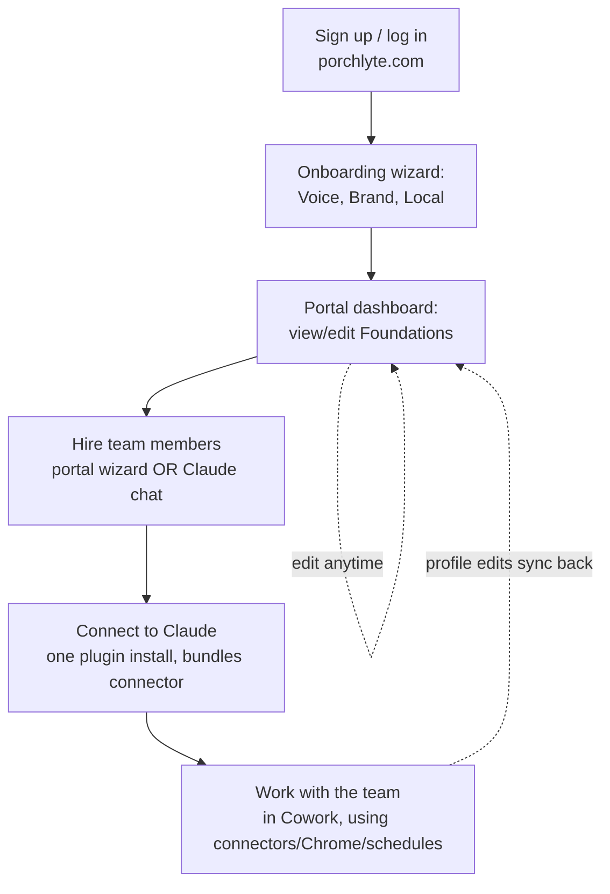

# PorchLyte MCP Server — Implementation Plan

**Status:** Draft v2 · July 15, 2026
**Goal:** Move member profiles (Foundations, team hires, and eventually memories) off local files and into PorchLyte-hosted infrastructure, and move the *hardest* part of onboarding — the setup interviews — out of Claude entirely and onto a portal you control.

1. **PorchLyte platform (porchlyte.com)** — members log in, do their onboarding (including Foundation and team setup) in a plain web wizard, and can view/edit everything afterward. No Claude account needed for this part.
2. **One consolidated Claude plugin** — Voice, Brand, Local, and all nine hires in a single install, with the PorchLyte connector bundled in. This is the only Claude-side step, and it happens last: "connect to Claude" is the moment someone's ready to go live, not a prerequisite for setup.

One account. One source of truth. Works in any Claude surface for actual work; works with no Claude account at all for setup.

---

## What changed from v1

The first draft assumed setup interviews still happened inside Claude chats, just saving to a hosted connector instead of local files. A working session against the real Cowork caching bug (documented below) changed the design in two ways:

- **Setup moves to the portal.** A web form calling the Claude API directly (with PorchLyte's own key) can write the same profile prose the chat interview used to, with zero dependency on the member having Claude installed, connected, or working. This removes Claude from the single most failure-prone part of onboarding.
- **Two plugins become one.** With hiring status now a database field instead of a local file's existence, there's no reason to stage Foundation and Team as separate installs. One plugin, one marketplace, one thing that can go stale — halving the surface area for the exact bug this session ran into.

The rest of the architecture (Postgres, MCP tools, portal-and-connector-as-two-doors-into-one-database) holds from v1.

---

## Why this architecture

| Approach | Ceiling |
|---|---|
| Local files (`~/porchlyte/`, shipped July 2026) | Cowork-only, one device, invisible to PorchLyte, strandable by plugin bugs |
| v1: hosted connector, setup still in Claude | Fixes storage, but onboarding still depends on Claude working correctly during first contact |
| **v2: portal onboarding + hosted connector + one plugin** | Setup never touches Claude; "connect to Claude" is a late, optional-feeling step; one plugin to keep in sync |

The member's actual working experience with Darla, Chloe, etc. still requires Cowork — connectors (Gmail/Calendar/Drive), Claude in Chrome, and Darla's scheduled morning brief are all Cowork-exclusive capabilities (confirmed by direct research against Anthropic's docs; standalone claude.ai Skills cannot do any of these). So the plugin isn't going away. What changes is that it no longer has to carry the interviews, the local-file logic, or the two-install sequencing — it becomes a thin layer whose only job is (a) let Claude act like each hire during real work, and (b) read/write the member's record through the connector.

---

## The member journey



Setup (B, D) can happen entirely without Claude. Hiring (D) can *also* happen inside a Claude chat later — same `save_team_member` call either way, so a "hired" status set by the portal and one set by a live interview are indistinguishable to the system. Connecting Claude (E) becomes the last step: the moment someone's ready to actually use their team, not a gate they have to clear to set anything up.

---

## Component 1: Data model

Postgres. Unchanged from v1 — this part was already right.

```
members
  id (uuid, pk)
  email (unique)
  name
  status            -- active | paused | canceled  (drives connector + tool access)
  plan              -- foundations | full-team     (Tracy sells Foundations standalone)
  created_at

profiles              -- the three Foundations
  id (uuid, pk)
  member_id (fk)
  kind              -- voice | brand | local
  content           -- text (the plain-prose profile)
  status            -- complete | partial | empty
  interview_answers -- jsonb, raw Q&A
  updated_at
  updated_by        -- portal_wizard | mcp_claude | admin

team_profiles         -- the nine hires
  id (uuid, pk)
  member_id (fk)
  agent             -- darla | chloe | poppy | treena | lia | sloane | rhonda | ella | olivia
  content           -- text
  status            -- not_hired | partial | hired
  interview_answers -- jsonb
  updated_at
  updated_by        -- portal_wizard | mcp_claude | admin

memories              -- phase 4
  id (uuid, pk)
  member_id (fk)
  agent
  content
  source            -- chat | portal | admin
  created_at

connector_status       -- new in v2: what the dashboard actually needs
  member_id (fk)
  plugin_installed_version
  plugin_latest_version
  last_successful_sync_at
  connector_linked_at

usage_events           -- powers member + admin analytics
  id (uuid, pk)
  member_id (fk)
  agent             -- which skill/agent triggered it (nullable for foundations)
  event             -- session_start | profile_read | profile_saved | task_run | ...
  metadata          -- jsonb
  created_at

scheduled_tasks        -- hub-managed state for Darla's brief, Rhonda's scan, etc.
  id (uuid, pk)
  member_id (fk)
  agent             -- darla | rhonda | ...
  state             -- active | paused
  schedule_label    -- human-readable ("weekdays 7:00 AM")
  last_run_at
  last_run_summary  -- one line: what the last run produced
  updated_at

audit_log
  member_id, actor, action, entity, timestamp
```

- **`updated_by` covers portal and Claude equally** — a profile written by the onboarding wizard and one written mid-chat by Chloe look identical downstream. This is what makes "hire on the portal or hire in Claude, your choice" actually true rather than aspirational.
- **`connector_status` is new** and exists specifically to make the dashboard a real diagnostic tool (see Component 3) instead of a vague checklist.
- Client records and the Objection Vault stay in Drive, as in v1.

---

## Component 2: The MCP server + API

Two callers hit the same backend:

- **The MCP server** (remote, Streamable HTTP, OAuth 2.1) — what the Claude plugin's skills call during real work.
- **A plain REST API** — what the portal's onboarding wizard and dashboard call. No Claude account involved; the wizard authenticates the member with their portal login and calls the Claude API server-side (PorchLyte's own key) to turn interview answers into profile prose, then writes straight to the same tables.

### MCP tools (phase 1)

| Tool | Args | Returns | Notes |
|---|---|---|---|
| `get_foundations` | — | voice, brand, local content + status | One call, all three |
| `save_foundation` | kind, content, answers? | ok + version | Upsert |
| `get_team_member` | agent | content + status | Status includes `not_hired` — the skill can offer to hire right there in chat |
| `save_team_member` | agent, content, answers? | ok | Same call whether triggered by a chat interview or a portal-initiated write |
| `get_setup_status` | — | full summary | Powers both the plugin's resume logic and the portal dashboard |
| `save_partial` | kind/agent, answers, next_question | ok | Real mid-interview resume, chat or portal |
| `get_task_state` | agent | active/paused + schedule | Scheduled skills (Darla, Rhonda) call this at the start of every run; if paused, they exit quietly. This is what makes the hub's pause/resume button real |
| `log_task_run` | agent, summary | ok | Scheduled skills log each completed run; feeds `last_run_at`/`last_run_summary` on the hub panel |

**Usage analytics come free from the server side:** every tool call is logged to `usage_events` automatically (which member, which agent, when). No extra tool needed — because every skill already calls `get_foundations`/`get_team_member` at session start, the server sees real usage without the skills doing anything special. This is what makes the admin dashboard's "how is the AI team actually being used" claim true rather than aspirational.

Phase 4 adds `add_memory`, `search_memories`, `log_touch`.

### Design rules

- **Idempotent upserts** — tolerate retries and double-saves.
- **Plan gating happens here, not at the plugin.** `save_team_member` checks `members.plan` before writing. A plugin being installed never implies access; the server is the actual boundary. (This also means Tracy can change what a tier includes without shipping a new plugin.)
- **Membership status gates every call.** Canceled → friendly error the skill can relay in-chat.
- **Version history on every write** — real undo instead of "show both versions and hope."

### Auth

- MCP OAuth 2.1 + PKCE for the Claude-facing side; standard session auth (Supabase Auth) for the portal side. Same underlying member record either way.
- Tokens revocable from the portal ("Disconnect Claude") and automatically on cancelation.

---

## Component 3: The portal (porchlyte.com)

This is the biggest structural change from v1: the portal isn't just a dashboard anymore, it's where onboarding actually happens.

**Onboarding wizard** (replaces the Claude-chat interviews for setup):
- Plain web forms for the Voice, Brand, and Local interviews — same questions as today's skills, same "one at a time, one follow-up if vague" pacing, just as a form flow instead of a chat.
- Submits to the API, which calls the Claude API server-side to write the profile prose in the same plain-prose format the skills produce today, and saves it.
- Same treatment for hiring: a "meet your team" wizard, one hire at a time, writing to `team_profiles` with `status: hired`.
- **Zero Claude account required for any of this.** A member can complete their entire setup before ever touching Claude.

**Per-agent spaces** — each of the nine hires gets a dedicated page in the hub: what they do, the prompts and tools built for them, hire status, and their usage stats (from `usage_events`). For scheduled agents (Darla, Rhonda), the page includes the schedule panel: active/paused toggle, schedule label, last run time and summary — backed by `scheduled_tasks` and the `get_task_state`/`log_task_run` tools. The toggle works because the skill checks state at the start of every run; the schedule itself is still created in Cowork.

**Dashboard** (the real diagnostic tool, not just a status page):
- Foundations: 3 chips (complete/partial/empty), last updated.
- Team: 9 chips (not hired/partial/hired).
- **Connector diagnostics**, new in v2, directly answering what this session spent an afternoon reverse-engineering by hand:
  - Plugin installed version vs. latest available version
  - Last successful sync timestamp
  - Connector linked yes/no, linked-since date
  - A plain-language status line: "Your plugin is out of date (v1.0 installed, v1.1 available) — click to update" or "Everything's current."
- "Connect to Claude" button, prominent but clearly late-stage, not a gate.

**Account:** membership status, connected Claude (revoke button), export-all-data (zip of markdown, same trust story as v1).

**Admin (Tracy + support):**
- Same setup-status visibility as v1, plus the connector diagnostics per member — turns "why does my AI sound generic" support into a glance instead of an investigation.
- Usage analytics from `usage_events`: sessions per member, which agents get used most, who's gone quiet, which agents nobody touches (product signal, not just support signal).
- Read/edit any member's profiles with consent, audit-logged.

---

## Component 4: One consolidated plugin

**Voice, Brand, Local, and all nine hires ship as a single plugin from a single marketplace**, with the PorchLyte connector declared in the plugin manifest so installing the plugin also links the connector in one guided flow.

Why one instead of two: the original Foundation/Team split existed to pace the interviews ("don't overwhelm a new member"). Once interviews can happen on the portal at the member's own pace, that reason disappears — and one plugin means one version to bump, one marketplace to sync, one thing to show "installed: yes/no" on the dashboard, and half the surface area for the caching bug this session hit.

**What each skill does now:**

- **Today:** "Read `~/porchlyte/voice.md`. If missing, run the interview, write the file."
- **v2:** "Call `get_foundations` on the connector. If `status: empty`, tell the member setup happens fastest at porchlyte.com, but offer to run the interview right here if they'd rather. Either way, on completion call `save_foundation`."
- **For hires specifically:** "Call `get_team_member`. If `status: not_hired`, offer to hire them right now in this chat, or point to the portal. If `status: hired`, go straight to work."
- **For scheduled skills (Darla, Rhonda):** call `get_task_state` at the start of every scheduled run — if paused, exit quietly without producing output. On completion, call `log_task_run` with a one-line summary. This pair is what makes the hub's schedule panel (pause/resume, last-run display) actually work.

Local files remain the offline fallback for anyone who never connects — same resilience promise as v1, unchanged.

**Migration for existing members — simpler than it looks.** The July 2026 local-file update (v1.1: `~/porchlyte/` folder + `/rescue`) was built and pushed to GitHub but **never rolled out to members** — the Cowork marketplace cache bug kept serving the old version, so the rollout was held. That means every existing member is still on the original chat-memory-only version, and there is only **one** migration to run, ever: old chats → platform. The recovery logic already designed for `/rescue` (signature phrases: "You write like", "Your brand is", "Darla is"...) carries over directly — it just saves through `save_foundation`/`save_team_member` instead of writing local files, driven from either the portal's import page or a chat prompt. The old two marketplaces get README pointers to the new single plugin.

---

## Distribution: the decision this session forced

This build ran directly into a reproducible Cowork bug: version bumped correctly, manifest correct, commit confirmed on `main` via `git ls-remote`, and the client's Cowork app *still* served a stale cached plugin after a full uninstall/reinstall — confirmed by inspecting the app's own on-disk plugin cache, which had no version field and no `rescue.md`, proving it never re-cloned from GitHub. This is a known, widely-reported issue (multiple open `anthropics/claude-code` GitHub issues on marketplace cache invalidation), not something fixable from the plugin side.

**For v1 launch, ship via manual `.zip` upload instead of GitHub-synced marketplace.** Concretely: Tracy (or the portal) provides a downloadable `.zip`; the member adds it via Claude's local plugin-dir/upload path rather than `/plugin marketplace add owner/repo`. This sacrifices auto-propagation — a new release means re-uploading a zip rather than members silently getting it — but it sidesteps the exact caching failure mode this session spent hours on, and it "actually works when you ship it," which matters more for a non-technical membership base than theoretical convenience.

**Revisit GitHub-sync distribution periodically.** Anthropic may fix the underlying cache bug; retest before committing the launch plan to it. Don't build the go-live date around an assumption that it's fixed.

**Test the `claude://` prefilled-install deep link before promising it in onboarding copy.** It's the closest thing to genuine one-click install that's documented, but its behavior for marketplace/plugin installs specifically hasn't been verified in this project. Confirm with a throwaway account before it appears in any member-facing instructions.

---

## Recommended stack

Everything on **Vercel + Supabase** — both already set up for this client, and one platform to operate beats two.

| Layer | Recommendation | Why |
|---|---|---|
| MCP server | TypeScript, **Next.js route handlers on Vercel** (via `mcp-handler` / Vercel's MCP adapter) | Lives in the same app as the portal — one repo, one deploy, one set of env vars. Vercel supports remote MCP servers natively |
| API (portal-facing) | Same Next.js app, plain route handlers | Same DB client, same auth context, zero extra services |
| Database | **Supabase** (managed Postgres + Auth) | One user table under both the connector and the portal |
| Portal | **Next.js on Vercel** | Already set up for this client; fast to build |

Running cost at 100–500 members: still roughly **$25–75/month**. The Claude API calls the onboarding wizard makes (writing profile prose from interview answers) are the one new variable cost — small per-member, worth metering from day one.

---

## Phased rollout

### Phase 0 — Spec freeze
Resolve open questions below, including the distribution-method decision and the hire-on-portal-vs-chat UX call. No code.

### Phase 1 — MCP core + API (the data layer works)
**First task, before anything else: the bundled-connector spike.** Build a stub plugin with the remote MCP connector declared in its manifest, install it from a `.zip` on a clean account, and confirm the OAuth flow fires cleanly in Cowork. If it does, "one install" is real. If it's janky, the fallback is plugin install + a one-click connector add from the portal — decide the onboarding story from evidence, not docs. (This week earned that rule.)

Then: DB schema (including `usage_events` and `scheduled_tasks`), MCP auth, the eight tools, plus the plain REST API the portal will call. Test both doors — Claude connector and direct API calls — against the same records.
**~2–3 weeks.**

### Phase 2 — Portal onboarding wizard
Voice/Brand/Local wizard, hiring wizard, dashboard with connector diagnostics. This is now the primary onboarding path, so it gets built before the plugin revision, not after.
**~2–3 weeks.**

### Phase 3 — Consolidated plugin
Merge Foundation + Team skills into one plugin/marketplace, connector-first with local-file fallback, migration path off the old two-plugin setup. Ship via manual zip per the distribution decision above.
**~1–2 weeks.**

### Phase 4 — Launch
Member rollout: portal-first messaging ("set up your team without touching Claude, then connect when you're ready"), migration push for existing members, launch-week support.
**~1 week.**

### Phase 5 — Memories + admin depth
`add_memory`/`search_memories`; deeper admin tooling; interview-answer regeneration; possible Objection Vault/client-record migration into the platform.
**Ongoing.**

---

## Risks and honest caveats

- **The onboarding wizard duplicates the interview logic** that today lives in the Claude skills (same questions, same "one at a time" pacing) — now in two places (portal form + skill prompt). Keep them in sync deliberately; consider driving both from one shared question spec rather than hand-maintaining twins.
- **Server-side Claude API calls for the wizard are a new cost center** — small, but real, and worth metering per-member from the start in case of abuse or runaway retries.
- **Manual zip distribution means releases require a manual step** (re-upload, tell members) instead of silent propagation. Acceptable tradeoff for reliability now; revisit once GitHub-sync is confirmed fixed.
- **You become a data custodian.** Unchanged from v1: privacy policy, backups, export button from day one.
- **The plugin still can't be truly one-click today.** The `claude://` deep link needs testing; until confirmed, plan onboarding copy around "a few guided clicks," not "one click."
- **Latency** on tool calls vs. local file reads — unchanged from v1, `get_foundations` batching mitigates it.

## Open questions (decide in phase 0)

1. **Who builds and maintains it?** Same question as v1.
2. **Hire-on-portal vs. hire-in-chat:** both will work technically — is there a UX reason to push members toward one over the other, or genuinely let them choose?
3. **Foundations-only tier gating:** confirm `plan`-based server-side gating covers what Tracy needs for the standalone Foundations product.
4. **Distribution mechanics for existing two-plugin members:** auto-superseded marketplace pointers vs. explicit one-time migration step.
5. **Membership status sync:** all billing runs through **Stripe** (today via GHL checkout). Since Stripe is the constant regardless of what happens with GHL, drive `members.status`/`plan` from **Stripe webhooks** directly — that way the sync survives any future move off GHL untouched. Signup itself stays in GHL for now; not a priority to move.
6. **Data residency/backup promises** for member-facing privacy copy.
7. **Naming** for the connector/plugin as it appears in a member's Claude settings.
8. **Retest cadence** for the GitHub-sync caching bug, so the manual-zip decision gets revisited on a schedule rather than forgotten.

---

*Companion docs to write as phases begin: `mcp-tool-spec.md`, `portal-wireframes.md` (onboarding wizard + dashboard), `migration-playbook.md` (two-plugin → one-plugin, and local-file → hosted cohorts).*
